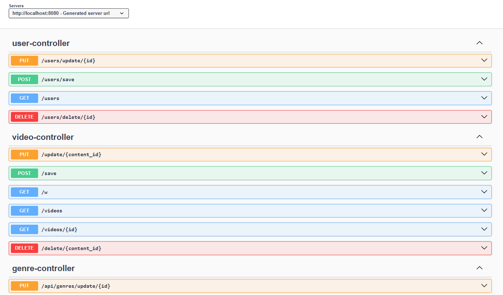
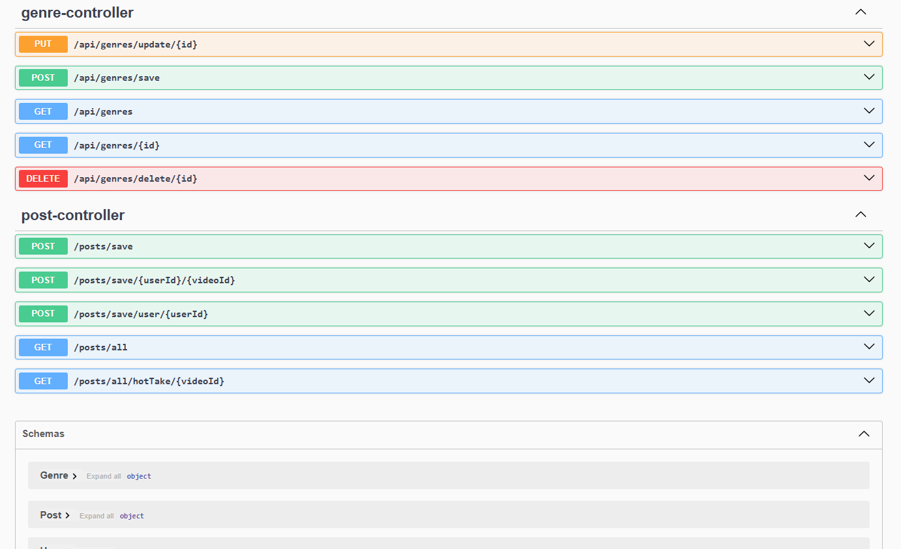
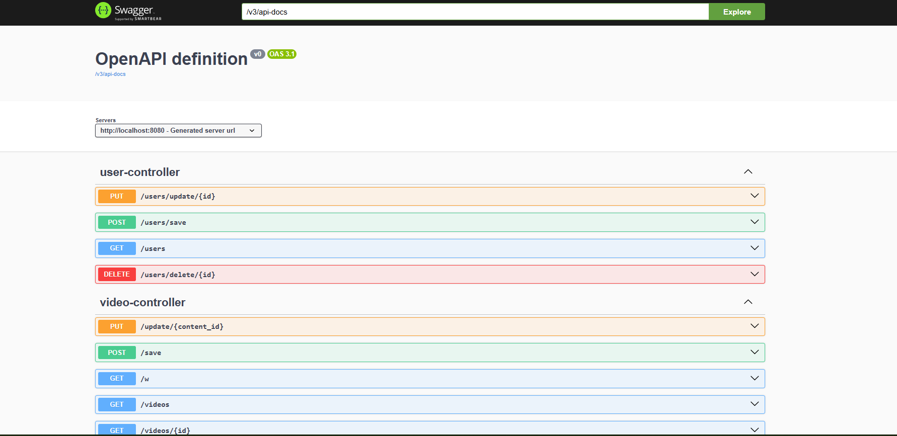

# Flixxer Backend API


Java Spring Boot backend for a team capstone video library and social-style web application.

This backend provides REST APIs that support video management, comments, and a social-style feed. The application connects to a MySQL database and was designed to support a React frontend.

---

## API Documentation (Swagger)

Interactive API documentation is available after starting the application:

http://localhost:8080/swagger-ui/index.html

---

## API Screenshots

<table>
<tr>
<td align="center">

<br><strong>Swagger API Overview</strong>
</td>

<td align="center">

<br><strong>Available API Endpoints</strong>
</td>
</tr>

<tr>
<td align="center">

<br><strong>OpenAPI Documentation Interface</strong>
</td>
</tr>
</table>

---

## Tech Stack

Backend
- Java
- Spring Boot
- Spring Data JPA

Database
- MySQL

Frontend (team project)
- React
- JavaScript

---

## Architecture

The backend follows a layered architecture using Spring Boot controllers, services, and JPA repositories to separate the API layer, business logic, and database access.

```
Client (React / Swagger UI)
│
▼
Controllers (REST API Endpoints)
│
▼
Services (Business Logic)
│
▼
Repositories (Spring Data JPA)
│
▼
MySQL Database
```
---

## Getting Started

Follow these steps to run the backend locally.

### 1. Clone the Repository

```bash
git clone https://github.com/kayanr/FlixxerBackEnd.git
cd FlixxerBackEnd
```
---
### 2. Ensure the Resources Directory Exists

The application expects configuration files inside:

```
src/main/resources
```

If the folder does not exist, create it.

Example project structure:
```
src
 └── main
      ├── java
      └── resources 
```
---
### 3. Create the Configuration File

Copy the example configuration file:
```
src/main/resources/application.properties.example
```
Create a new file named:
```
src/main/resources/application.properties
```
Then update the database credentials.

Example configuration:
```properties
spring.datasource.url=jdbc:mysql://localhost:3306/flixxer_db
spring.datasource.username=YOUR_USERNAME
spring.datasource.password=YOUR_PASSWORD

spring.jpa.hibernate.ddl-auto=update
spring.jpa.show-sql=true
spring.jpa.database-platform=org.hibernate.dialect.MySQLDialect
```
---
### 4. Create the Database

Create a MySQL database named:
```
flixxer_db
```
Example:
```sql
CREATE DATABASE flixxer_db;
```
---
### 5. Run the Application

Run the project using Maven:
```bash
mvn spring-boot:run
```

---
### 6. Open Swagger UI

Once the application starts, open:
```
http://localhost:8080/swagger-ui/index.html
```
Swagger provides interactive documentation for testing all API endpoints.

---
## Features

• Video Management – upload, retrieve, and manage video content  
• Comments – store and retrieve comments associated with videos  
• Social Feed – create and retrieve tweets/posts  

---

## Project Context

This project was developed as part of a 5-person bootcamp capstone project.

I contributed as one of the backend developers, focusing on building the Spring Boot REST APIs and integrating the application with MySQL.
